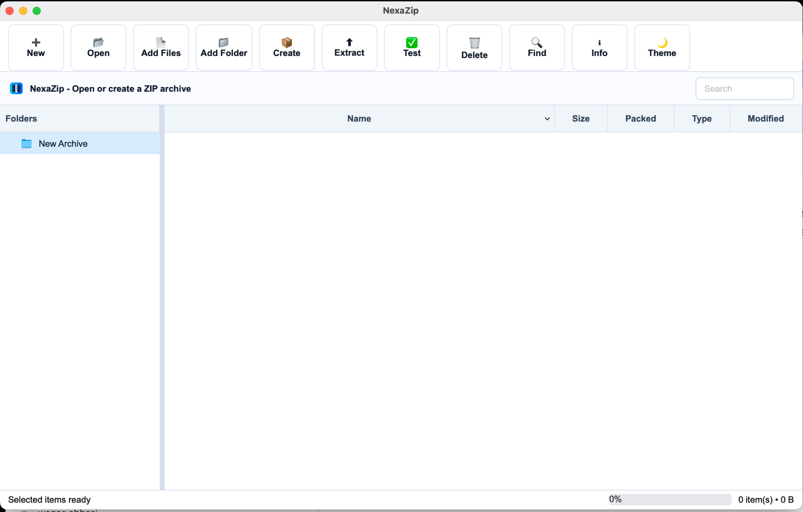
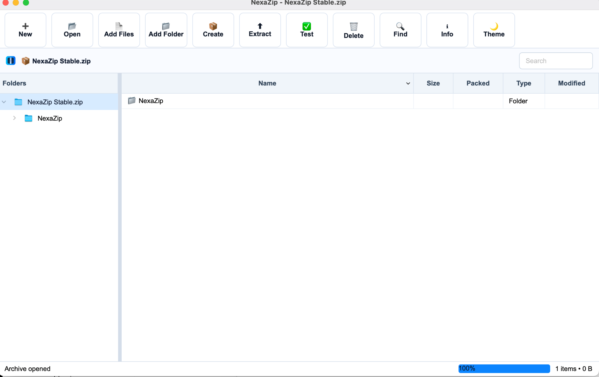
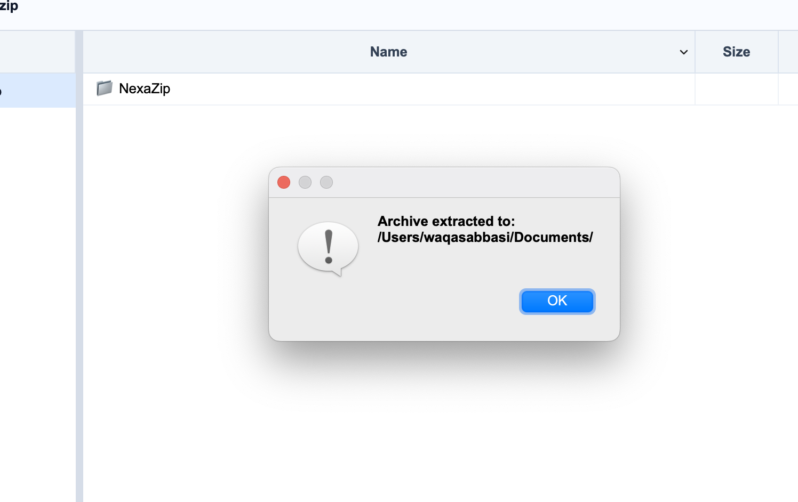
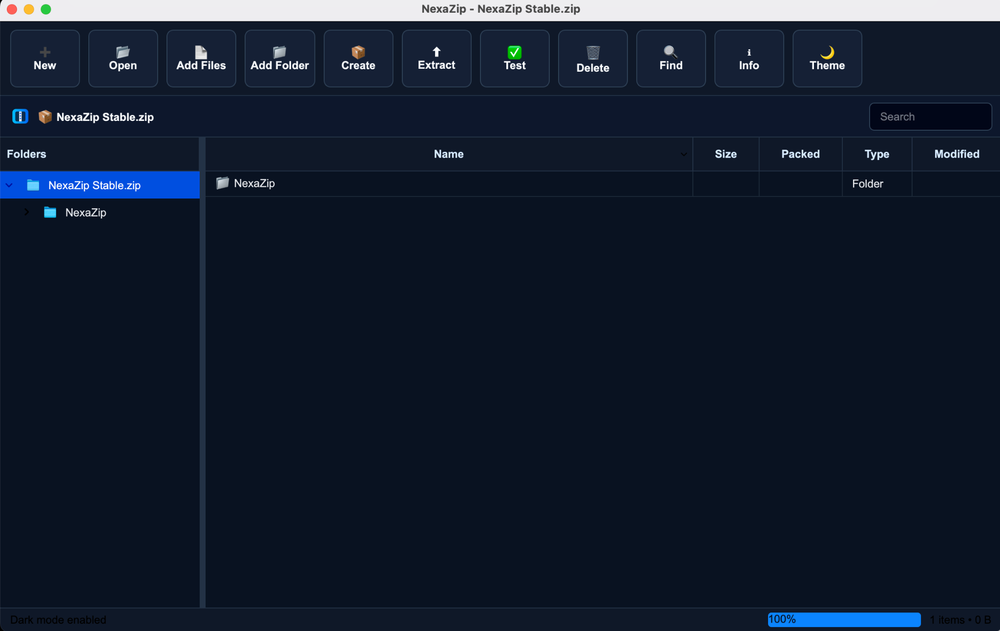

<div align="center">


# NexaZip

### Fast • Secure • Native • Cross-Platform

A professional desktop ZIP archive manager built with **C++20**, **Qt6 Widgets**, **CMake**, and **zlib**.

NexaZip is designed to deliver a clean, native, and modern archive management experience across **Windows**, **macOS**, and **Linux**.

---


</div>

---

## Overview

**NexaZip** is a lightweight, native, WinRAR-inspired archive manager focused on a smooth ZIP workflow.
It supports creating, opening, extracting, updating, searching, and testing ZIP archives with a modern desktop interface.

The application uses the operating system’s **default native title bar**, so window controls look correct on every platform.

---

## Key Features

### Archive Management

* Create ZIP archives
* Open existing ZIP archives
* Extract ZIP archives
* Update opened ZIP archives
* Add files and folders
* Preserve folder structure
* Remove staged items before updating
* CRC integrity testing
* ZIP Deflate support with zlib

### Native Desktop Experience

* Native Windows title bar
* Native macOS title bar
* Native Linux window decorations
* System default minimize, maximize, and close buttons
* No custom duplicate window controls
* Responsive desktop layout

### Modern Interface

* Light Mode
* Dark Mode
* Folder preview
* Archive file list
* Search bar
* Drag and drop support
* Status bar
* WinRAR-style workflow

---

## Screenshots

### Light Mode Dashboard



### Open Archive View



### Extract Dialog



### Dark Mode



---

## Cross-Platform Support

| Platform | Status    |
| -------- | --------- |
| Windows  | Supported |
| macOS    | Supported |
| Linux    | Supported |

NexaZip is built with Qt6 and uses native operating system window decorations for a consistent desktop experience.

---

## Technology Stack

| Component    | Technology        |
| ------------ | ----------------- |
| Language     | C++20             |
| UI Framework | Qt6 Widgets       |
| Build System | CMake             |
| Compression  | zlib              |
| Interface    | Native Desktop UI |
| License      | GPL-3.0           |

---

## Project Structure

```text
NexaZip/
├── archive/
│   ├── ZipEngine.cpp
│   └── ZipEngine.h
├── icons/
│   └── app.svg
├── include/
│   └── MainWindow.h
├── resources/
│   └── resources.qrc
├── screenshots/
│   ├── dashboard.png
│   ├── open_archive.png
│   ├── extract_dialog.png
│   └── dark_mode.png
├── src/
│   ├── MainWindow.cpp
│   └── main.cpp
├── themes/
│   ├── light.qss
│   └── dark.qss
├── tests/
├── third_party/
├── CMakeLists.txt
├── LICENSE
├── README.md
└── .gitignore
```

---

## Build Instructions

### macOS

```bash
brew install cmake qt

git clone https://github.com/waqas12-lab/NexaZip.git
cd NexaZip

mkdir build
cd build

cmake .. -DCMAKE_PREFIX_PATH=$(brew --prefix qt)
cmake --build . -j8

open NexaZip.app
```

### Windows

```bash
git clone https://github.com/waqas12-lab/NexaZip.git
cd NexaZip

mkdir build
cd build

cmake ..
cmake --build . --config Release
```

### Linux

```bash
git clone https://github.com/waqas12-lab/NexaZip.git
cd NexaZip

mkdir build
cd build

cmake ..
cmake --build . -j
./NexaZip
```

---

## Current Format Support

| Format | Create | Extract | Notes             |
| ------ | ------ | ------- | ----------------- |
| ZIP    | Yes    | Yes     | Deflate supported |
| RAR    | No     | Planned | Future roadmap    |
| 7Z     | No     | Planned | Future roadmap    |

---

## Roadmap

* AES password protection
* 7Z extraction
* RAR extraction
* Multi-volume archives
* Archive repair tools
* File association support
* Installer packages for Windows, macOS, and Linux

---

## License

This project is licensed under the **GNU General Public License v3.0**.

---

<div align="center">

### NexaZip

**Native archive management for every desktop platform.**

Built with C++ and Qt.

</div>
